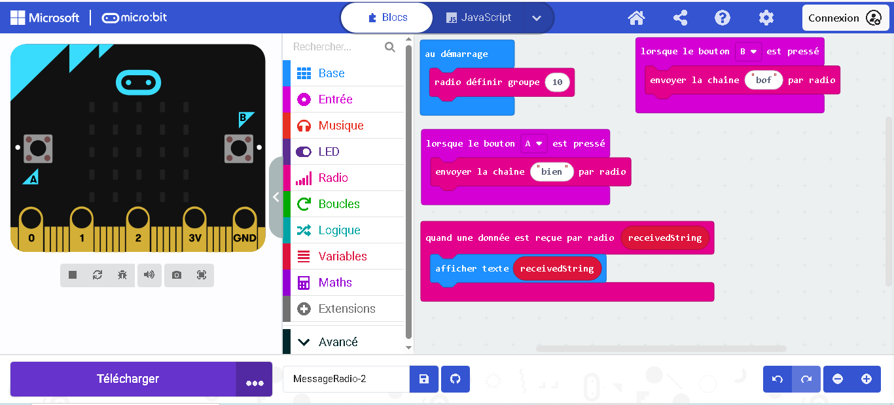

# Program_MicroBit

Repository contenant les différents programmes que j’ai réalisés avec une **Micro:bit** pendant mon année scolaire.

---

## 🎯 Objectif

Ce repository sert à :

* garder une trace de tous mes projets Micro:bit
* partager mes programmes
* montrer mon apprentissage de la programmation

---

## 🖼 Exemple de Micro:bit

---

## ▶ Comment utiliser les programmes

1. Ouvrir **MakeCode Micro:bit**
2. Importer le fichier `.hex` ou `.js`
3. Connecter la carte Micro:bit
4. Télécharger le programme sur la carte

---

## 📅 Année scolaire

**2025 - 2026**

---

## 👨‍💻 Auteur

Projet réalisé par **4EverStars**

